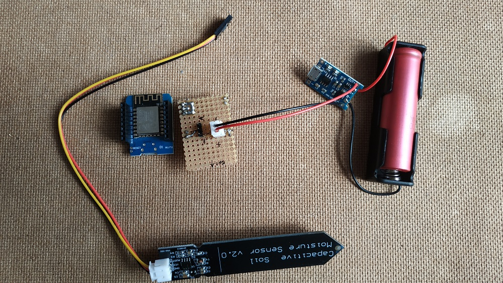
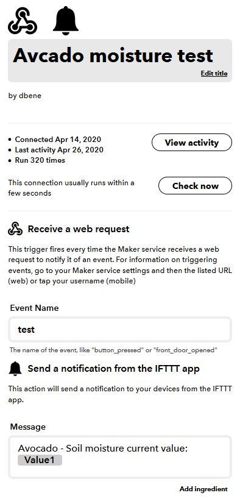
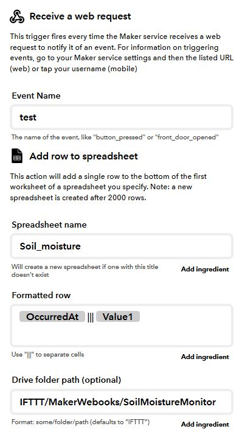

# esp-moisture-notifier
A really basic platformio project to trigger an IFTTT notification if a plant's moisture sensor reads low values.
The IFTTT webhook trigger uses plain html call! Only use this solution, if your use-case allow this not really secure implementation.

Hardware is a D1-mini, with a capacitive soil moisture sensor, supplied by a 18650 power cell. I made a simple d1 mini shield for the parts to connect to.

## ifttt
Basically you need a connection between a webhook event (imagine this like a public html link) and your phone's IFTTT app. When the arduino calls that specific link, you will get a predefined notification to your phone. You can make logging too with the spreadsheet connection easily.
The pictures below shows a test setup, you will need something like these modified to match your requirements. 

 

## calibration

Calibration is key when using a moisture sensor. The values differ based on many aspects (soil denseness, saltness, sensor position, depth etc.). Be sure to find out the proper value for the `DRYNESS_ALARM_VALUE` before you trust the plant's life on the system.

PRO TIP: you can make the sensor's pcb sides, and smds waterproof with nail polish.
